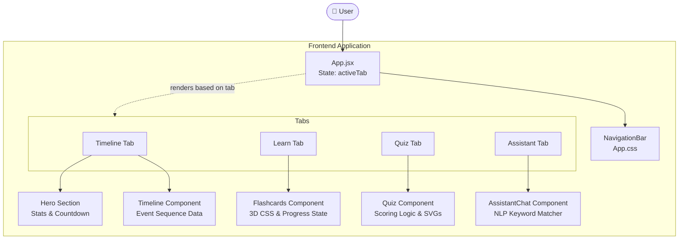

# 🗳️ Election Copilot

**Election Copilot** is a premium, interactive web application designed to educate citizens about the democratic election process. Built with modern web technologies, the platform features a sleek glassmorphism design, interactive components, and an intelligent local AI assistant.

---

## 🌟 Key Features

1. **Process Timeline** 📈 
   A step-by-step visual breakdown of how an election unfolds, from the initial announcement to the formation of the government.
2. **Interactive Flashcards** 📚 
   3D flippable cards to help users master essential political vocabulary (e.g., Gerrymandering, Electoral College, VVPAT). Includes a "Mark as Learned" progress tracker.
3. **Knowledge Quiz** 🏆 
   Test your election knowledge with a multi-choice quiz that provides instant feedback, explanations, and an animated score ring upon completion.
4. **Smart AI Assistant** 🤖 
   A built-in chat interface powered by a custom local knowledge base. It instantly answers user queries regarding voter registration, polling day procedures, electoral systems, and more.

---

## 🏗️ Architecture & Component Flow

The application is structured as a Single Page Application (SPA) using React. Below is a diagram illustrating the component architecture and how users interact with the app.



---

## 🛠️ Technology Stack

* **Core:** React 19, Vite
* **Styling:** Custom CSS with Glassmorphism, Animations, and Dark Mode Aesthetics
* **Icons:** Lucide React
* **Containerization:** Docker (Multi-stage build with Alpine Node & Nginx)
* **CI/CD & Cloud:** Google Cloud Build, Artifact Registry, Google Cloud Run

---

## 🚀 Deployment Guide (Google Cloud Run)

This project is fully configured for production deployment on **Google Cloud Run**.

### Prerequisites
1. Install the [Google Cloud CLI](https://cloud.google.com/sdk/docs/install) (`gcloud`).
2. Authenticate your terminal:
   ```bash
   gcloud auth login
   ```
3. Set your active GCP project:
   ```bash
   gcloud config set project [YOUR_PROJECT_ID]
   ```

### Deployment Steps
1. **Enable required Google Cloud APIs:**
   ```bash
   gcloud services enable run.googleapis.com cloudbuild.googleapis.com artifactregistry.googleapis.com
   ```
2. **Create a Docker Artifact Registry (One-time setup):**
   ```bash
   gcloud artifacts repositories create election-assistant --repository-format=docker --location=us-central1
   ```
3. **Build the Docker Image via Cloud Build:**
   ```bash
   gcloud builds submit --tag us-central1-docker.pkg.dev/[YOUR_PROJECT_ID]/election-assistant/app:latest .
   ```
4. **Deploy to Cloud Run:**
   ```bash
   gcloud run deploy election-assistant \
     --image us-central1-docker.pkg.dev/[YOUR_PROJECT_ID]/election-assistant/app:latest \
     --region us-central1 \
     --platform managed \
     --allow-unauthenticated \
     --port 8080
   ```

---
*Built with ❤️ to empower every voter.*
